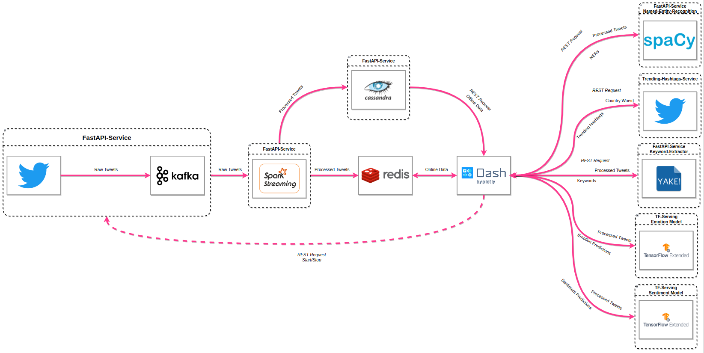

# Streaming Microservice Architecture

## What is it?
It is a real-time tweets text analysis dashboard.

## Idea
To be able to keep up with trending hashtags and topics, a dashboard is used to get keywords, entities, tweets' sentiment, tweets' emotions, and frequent words of a given hashtag/topic.
## Architecture

Implemented Lambda Architecture to handle the streaming of twitter's data ingested by Kafka, then to Spark to be processed, then stored in Cassandra as the batch storage, and to Redis as the speed layer to be analyzed in Dash. Each component is its own microservice. 
 
 

**Microservices:**

- TwitterHandler is a python package (<a href="">TwitterHandler-pypi</a>) it handles twitter' data stream from twitter api v2 and ingest it into Kafka. Accessible via an API and deployed in a docker container. <a href=""> TwitterHandler-github</a>

- SparkStream is a python package (<a href="">SparkStream-pypi</a>). A simple spark streaming handler; it listens to a kafka topic, process the data, and store it into cassandra and redis. Accessible via an API and deployed in a docker container. <a href=""> SparkStream-github</a>

 - Named-Entity-Recognition is a service for extracting NERs from text by spacy. Accessible via an API and deployed in a docker container. <a href=""> NER-github</a>

 - Keyword-Extraction is a service for extracting keywords from text by yake. Accessible via an API and deployed in a docker container. <a href=""> Keyword-github</a>

 - Sentiment-Model is a service for predicting tweet's sentiment. Developed by tensorflow extended and deployed with tensorflow-serving. <a href=""> Sentiment-github</a>

 - Emotion-Model is a service for predicting tweet's emotions. Developed by tensorflow extended and deployed with tensorflow-serving. <a href=""> Emotion-github</a>

 - Trending-Hashtags is a service for getting trending hashtags in a given country from twitter api v1. Accessible via an API and deployed in a docker container. <a href=""> Trending-github</a>

 

**Technologies:**
 
* Tweepy
* Apache Kafka
* Apache Spark
* Apache Cassandra
* Redis
* Dash
* TenorFlow extended
* FastAPI
* Spacy
* NLTK
* Yake

**Data:**
 
- Trending hashtags are from the trend places endpoint of the Twitter API v1.
- Twitter's streaming data are from the filtered stream endpoint of the Twitter API v2.